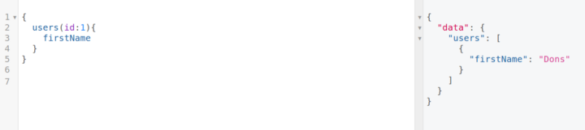

To sart here are some advantages of using graphql:

- Avoids having to create many routes to handle everything
- Avoids over-fetching and under-fetching data
- This works concurrently with API routes so the server can still be RESTful

**Install devDependencies**

`npm init -y`

`npm install @babel/core @babel/node @babel/preset-env nodemon --save-dev`

**Setting Up the Express server**

First thing to do is install express and make an *index.js* file

`npm install express`

This server will be using the Hello World! example from express documentation but with some small changes to incorporate import.

```
import express from 'express'
const app = express()
const port = 3000app.get('/', (req, res) => {
  res.send('Hello World!')
})app.listen(port, () => {
  console.log(`Example app listening at http://localhost:${port}`)
})
```

The simple server is up and running here and needs sequelize models.

---

**Setting up models with sequelize**

Create a postgreSQL database using the below command, this server's database will be called *devtest*

`createdb devtest`

Install sequelize and its drivers. Sequelize will convert the javascript code into SQL but pg and pg-hstore communicate with postgreSQL and make the actual changes.

`npm install sequelize pg pg-hstore.`

Create a new folder called database and a models folder inside that and a models.js file in that. Here the actual models will be made. Import sequelize and create a new instance of Sequelize passing in a string with the name of the database “postgres://localhost:5432/devtest”

`import Sequelize from 'sequelize'`
`const sequelize = new Sequelize(`postgres://localhost:5432/devtest`)`

On this same file create a model. In this example, a user model is created with only a firstName property that must be set to valid because allowNull is set to false. Each property must have a Sequelize type. More Seqeulize types can be found in the Sequelize documentation. These datatypes ensure the information stored is of the same type.

```
const User = sequelize.define('user', {
  // attributes
  firstName: {
    type: Sequelize.STRING,
    allowNull: false
  }
})
```

Put some example data to have a better look at whats going on.

```
sequelize.sync({ force: true }).then(() => {
  return User.create({
    firstName: 'Dons'
  })
})
```

Export this database so it can be used for the graphQL schemas.

`export default sequelize;`

**Setting up GraphQL Schema**
Inside the *database* folder create a *schema* folder and in there create a *schema.js* file. Import the sequelize file.

`import db from '../models/models'`

There are special graphQL datatypes that will be needed. This example will use the ones below.

`import {GraphQLObjectType, GraphQLString, GraphQLInt, GraphQLSchema, GraphQLList, GraphQLNonNull } from 'graphql'`

Since graphQL is a middleware, special graphQL objects are needed in order for graphQL to know what to do. For this example,

```
const User = new GraphQLObjectType({
  name: 'User',
  description: 'this represents a user',
  fields: () => {
    return {
      id: {
        type: GraphQLInt,
        resolve(user) {
          return user.id
        }
      },
      firstName: {
        type: GraphQLString,
        resolve(user) {
          return user.firstName
        }
      }
    }
  }
})
```
The GraphQLObjectType that was created above is a graphQL schema for the Sequelize model that was made for the Users model above. Each field corresponds to a field in the Sequelize model and has a graphql type that dictates what the datatype should be. GraphQL handles the promise received from Sequelize when requests are made through the resolve function.

That is just the Schema for a user, to make a query a whole new GraphQLObjectType needs to be made. This one has some extra fields and the GraphQL datatype is GraphQLList(User) which refers to the schema that was made above. The resolve function also works a bit differently from the User Schema as it as a 2nd parameter, “args”. “args” is the data that will be passed in.

```
const Query = new GraphQLObjectType({
  name: 'Query',
  description: 'this is a root query',
  fields: () => {
    return {
      users: {
        type: new GraphQLList(User),
        args: {
          id: {
            type: GraphQLInt
          },
          firstName: {
            type: GraphQLString
          }
        },
        //validations can go here
        resolve(root, args) {
          return db.models.user.findAll({ where: args })
        }
      }
    }
  }
})
```

That is just for making a query. In order to make post requests a GraphQLObjectType called mutation needs to be made. This is similar to the query GraphQLObjectType but in it, changes to the database will be made.

```
const Mutation = new GraphQLObjectType({
  name: 'Mutation',
  description: 'Functions to create things',
  fields: () => {
    return {
      addUser: {
        type: User,
        args: {
          firstName: {
            type: new GraphQLNonNull(GraphQLString)
          }
        },
        resolve(_, args) {
          return UserModel.create({
            firstName: args.firstName
          })
        }
      }
    }
  }
})
```

Finally to connect it all together GraphQLSchema must be called and initialized with the Query and Mutation objects that were made. This Schema has to be exported to be connected in the *index.js* file.

```
const Schema = new GraphQLSchema({
  query: Query,
  mutation: Mutation
})
```

`export default Schema`

With all the schemas and models set up, the server is finally ready to use the middleware.

`import { graphqlHTTP } from 'express-graphql'`
`import Schema from './database/schema/schema'`

Create a new express route passing the graphqlHTTP middleware. In this server, it will be ‘graphql’ route.

```
import express from 'express'
import { graphqlHTTP } from 'express-graphql'
import Schema from './database/schema/schema'

const app = express()
const port = 3000

app.use('/graphql', graphqlHTTP({ schema: Schema, graphiql: true }))

app.get('/', (req, res) => {
  res.send('Hello World!')
})

app.listen(port, () => {
  console.log(`Example app listening at http://localhost:${port}`)
})
```

As mentioned earlier, graphQL and RESTful API’s can work concurrently so that the ‘/’ route still works.

To test the ‘/graphql’ route npm install graphiql, an easy to use GUI to test queries then go to ‘http://localhost:3000/graphql’

`npm install graphiql`


