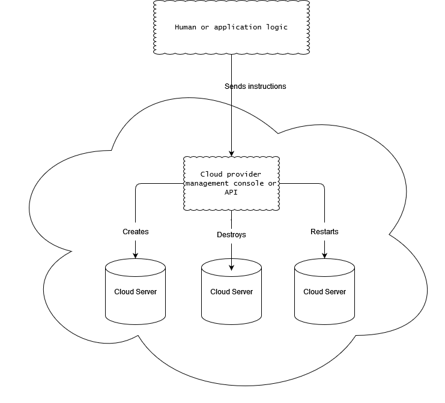
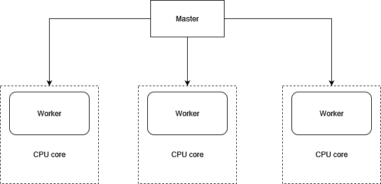
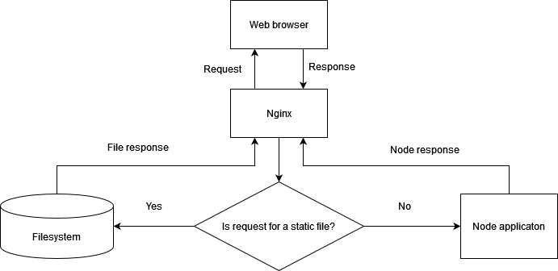

When you’re faced with deploying a web application, you’ll find yourself considering
where to host it. You’ll want to consider how to monitor your application and
keep it running. You may also wonder what you can do to make it as fast as possible.
In this article, you’ll get an overview of how to address these concerns for your
Node web application.

## 1. Hosting Node applications

Most web application developers are familiar with PHP-based applications. When an
Apache server with PHP support gets an HTTP request, it’ll map the path portion of
the requested URL to a specific file, and PHP will execute the contents of the file. This
functionality makes it easy to deploy PHP applications: you upload PHP files to a certain
location of the filesystem, and they become accessible via web browsers. In addition to
being easy to deploy, PHP applications can also be hosted cheaply, because servers are
often shared between a number of users.

Deploying Node applications using Node-specific cloud-hosting services offered by
companies like Joyent, Heroku, Nodejitsu, VMware, and Microsoft is no more difficult.
Node-specific cloud-hosting services are worth looking into if you want to avoid
the trouble of administering your own server or want to benefit from Node-specific
diagnostics, such as Joyent SmartOS’s ability to measure which logic in a Node application
performs slowest. The Cloud9 website, itself built using Node.js, even offers a
browser-based integrated development environment (IDE) in which you can clone
projects from GitHub, work on them via the browser, and then deploy them to a number
of Node-specific cloud hosting services

An alternative to Node-specific cloud hosting is running your own server. Linux is a
popular choice for Node servers and offers more flexibility than Node-specific cloud
hosting because you can easily install any related applications you need, such as database
servers. Node-specific cloud-hosting services typically offer a limited selection of
related applications.

Linux server administration is its own realm of expertise, however. If you choose to
handle your own deployment, you’ll need to read up on your chosen Linux variant to
be sure you’re familiar with setup and maintenance procedures.

VIRTUALBOX If you’re new to server administration, you can experiment by
running software like VirtualBox (www.virtualbox.org/), which allows you to
run a virtual Linux computer on your workstation, no matter what operating
system your workstation runs.

let’s talk about the options available to you:

- Dedicated servers
- Virtual private servers
- General purpose cloud servers

### Dedicated and virtual private servers
Your server may either be a physical one, commonly known as a dedicated server, or a
virtual one. Virtual servers run inside physical servers and are assigned a share of the
physical server’s RAM, processing power, and disk space. Virtual servers emulate physical
servers and you can administer them in the same way. More than one virtual server
can run inside a physical server.

Dedicated servers are usually more expensive than virtual servers and often
require more setup time because components may have to be ordered, assembled,
and configured. Virtual private servers (VPSs), on the other hand, can be set up
quickly because they’re created inside preexisting physical servers.
VPSs are a good hosting solution for web applications if you don’t anticipate quick
growth in usage. VPSs are cheap and can easily be allocated additional resources,
when needed, such as disk space and RAM. The technology is established, and many
companies, such as Linode (www.linode.com/) and Prgmr (http://prgmr.com/xen/)
make it easy to get up and running.

VPSs, like dedicated servers, can’t usually be created on demand. Nor can they handle
quick growth in usage, because that requires the ability to quickly add more servers
without relying on human intervention. To handle such requirements, you’ll need
to use cloud hosting.

### Cloud hosting

Cloud servers are similar to VPSs in that they’re virtual emulations of dedicated servers.
But they have an advantage over dedicated servers and VPSs in that their management
can be fully automated. Cloud servers can be created, stopped, started, and
destroyed using a remote interface or API.

Why would you need this? Let’s say you’ve founded a company that has Nodebased
corporate intranet software. You’d like clients to be able to sign up for your
service and, shortly after signing up, receive access to their own server running your
software. You could hire technical staff to set up and deploy servers for these clients
around the clock, but unless you maintained your own data center, they’d still have to
coordinate with dedicated or VPS server providers to provide the needed resources in
a timely manner. By using cloud servers, you could have a management server send
instructions via an API to your cloud hosting provider to give you access to new servers
as needed. This level of automation enables you to deliver services to the customer
quickly and without human intervention.



The downside to using cloud servers is that they tend to be more expensive than VPSs
and can require some knowledge specific to the cloud platform.

### Amazon Web Services

The oldest and most popular cloud platform is Amazon Web Services (AWS; http://
aws.amazon.com/). AWS consists of a range of different hosting-related services, like
email delivery, content-delivery networks, and lots more. Amazon’s Elastic Compute
Cloud (EC2), one of AWS’s central services, allows you to create servers in the cloud
whenever you need them.
EC2 virtual servers are called instances, and they can be managed using either the
command line or a web-based control console, shown in figure 12.2. As command-line
use of AWS takes some time to get used to, the web-based console is recommended for
first-time users.
Luckily, because AWS is ubiquitous, it’s easy to get help online and find related
tutorials, such as Amazon’s “Getting Started with Amazon EC2 Linux Instances”
(http://mng.bz/cw8n).

## Deployment basics

Suppose you’ve created a web application that you want to show off, or maybe you’ve
created a commercial application and need to test it before putting it into full production.
You’ll likely start with a simple deployment, and then do some work later to maximize
uptime and performance. In this section, we’ll walk you through a simple,
temporary Git deployment, as well as how you can keep the application up and running
with Forever. Temporary deploys don’t persist beyond reboots, but they have the
advantage of being quick to set up.

### Deploying from a git repository
Deployment is most commonly done by following these steps:
- Connect to a server using SSH.
- Install Node and version control tools (such as Git or Subversion) on the server if needed.
- Download application files, including Node scripts, images, and CSS stylesheets, from a version control repository to the server.
- Start the application.

Here’s an example of an application starting after downloading the application files
using Git:

```
git clone https://github.com/Marak/hellonode.git
cd hellonode
node server.js
```

Like PHP, Node doesn’t run as a background task. Because of this, the basic deployment
we outlined would require keeping the SSH connection open. As soon as the
SSH connection closes, the application will terminate. Luckily, it’s fairly easy to keep
your application running using a simple tool like nodemon or forever.

```
sudo npm install -g forever
forever start server.js
forever stop server.js
```

## Maximizing uptime and performance
Once a Node application is release-worthy, you’ll want to make sure it starts and stops
when the server starts and stops, and that it automatically restarts when the server
crashes. It’s easy to forget to stop an application before a reboot or to forget to restart
an application afterward.
You’ll also want to make sure you’re taking steps to maximize performance. For
example, it makes sense when you’re running your application on a server with a
quad-core CPU to not use only a single core. If you’re using only a single core and
your web application’s traffic increases significantly, a single core may not have the
processing capability to handle the traffic, and your web application won’t be able to
consistently respond.
In addition to using all CPU cores, you’ll want to avoid using Node to host static
files for high-volume production sites. Node is geared toward interactive applications,
such as web applications and TCP/IP protocols, and it can’t serve static files as efficiently
as software optimized to do only that. For serving static files you’ll want to use
technologies like Nginx (http://nginx.org/en/), which specializes in serving static
files. Alternatively, you could upload all your static files to a content delivery network
(CDN), like Amazon S3 (http://aws.amazon.com/s3/), and reference those files in
your application.
In this section, we’ll cover some server uptime and performance tips:
- Using Upstart to keep your application up and running through restarts and crashes
- Using Node’s cluster API to utilize multicore processors
- Serving Node application static files using Nginx

### Maintaining uptime with Upstart
Let’s say you’re happy with an application and want to market it to the world. You
want to make dead sure that if you restart a server, you don’t then forget to restart
your application. You also want to make sure that if your application crashes, it’s not
only automatically restarted, but the crash is logged and you’re notified, which allows
you to diagnose any underlying issues.
Upstart (http://upstart.ubuntu.com) is a project that provides an elegant way to
manage the starting and stopping of any Linux application, including Node applications.
Modern versions of Ubuntu and CentOS support the use of Upstart.
You can install Upstart on Ubuntu, if it’s not already installed, with this command:
`sudo apt-get install upstart `
Once you’ve installed Upstart, you’ll need to add an Upstart configuration file for
each of your applications. These files are created in the /etc/init directory and are
named something like my_application_name.conf. The configuration files do not
need to be marked as executable.
The following will create an empty Upstart configuration file for this chapter’s
example application:
`sudo touch /etc/init/hellonode.conf`

Now add the contents of the following listing to your config file. This setup will run
the application when the server starts up and stop it upon shutdown. The exec section
is what gets executed by Upstart.

```
author "Robert DeGrimston"
setuid "nonrootuser"

start on (local-filesystems and net-device-up IFACE=eth0)
stop on shutdown

respawn
console log
env NODE_ENV=production

exec /usr/bin/node /path/to/server.js
```
This configuration will keep your process up and running after the server restarts and
even after it crashes unexpectedly. All the application-generated output will be sent to
/var/log/upstart/hellonode.log, and Upstart will manage the log rotation for you.
Now that you’ve created an Upstart configuration file, you can start your application
using the following command:
`sudo service hellonode`
If your application was started successfully, you’ll see a line like this:
`hellonode start/running, process 6770`
Upstart is highly configurable. Check out the online cookbook (http://upstart.ubuntu.com/cookbook/) for all the available options.


**Upstart and respawning**

When the `respawn` option is used, Upstart will by default continually reload your application
on crashes unless the application is restarted 10 times within 5 seconds. You
can change this limit using the `respawn limit COUNT INTERVAL option`, where `COUNT`
is the number of times within the `INTERVAL`, which is specified in seconds. For example,
you’d set a limit of 20 times in 5 seconds like this:
```
respawn
respawn limit 20 5
```
If your application is reloaded 10 times within 5 seconds (the default limit), typically
there’s something wrong in the code or configuration, and it will never start successfully.
Upstart won’t try to restart after reaching the limit in order to save resources for
other processes.
It’s a good idea to do health checks outside of Upstart that provide alerts to the development
team through email or some other means of quick communication. A health
check, for a web application, can simply involve hitting the website and seeing if you
get a valid response.

### The cluster API: taking advantage of multiple cores
Most modern computer CPUs have multiple cores, but a Node process uses only one
of them when running. If you were hosting a Node application on a server and wanted
to maximize the server’s usage, you could manually start multiple instances of your
application on different TCP/IP ports and use a load balancer to distribute web traffic
to these different instances, but that’s laborious to set up.
To make it easier to use multiple cores for a single application, the cluster API was
added to Node. This API makes it easy for your application to simultaneously run multiple
“workers” on different cores that each do the same thing and respond to the
same TCP/IP port. Figure 12.4 shows how an application’s processing would be organized
using the cluster API on a four-core processor.



The following listing automatically spawns a master process and a worker for each
additional core.

```
var cluster = require('cluster');
var http = require('http');
var numCPUs = require('os').cpus().length;

if (cluster.isMaster) {
  for (var i = 0; i < numCPUs; i++) {
    cluster.fork();
  }
  cluster.on('exit', function(worker, code, signal) {
    console.log('Worker ' + worker.process.pid + ' died.');
  });
} else {
  http.Server(function(req, res) {
    res.writeHead(200);
    res.end('I am a worker running in process ' + process.pid);
  }).listen(8000);
}
```
Because masters and workers run in separate operating system processes, which is necessary
if they’re to run on separate cores, they can’t share state through global variables.
But the cluster API does provide a means for the master and workers to
communicate.
The following listing shows an example in which messages are passed between the
master and the workers. A count of all requests is kept by the master, and whenever a
worker reports handling a request, it’s relayed to each worker.

```
var cluster = require('cluster');
var http = require('http');
var numCPUs = require('os').cpus().length;
var workers = {};
var requests = 0;

if (cluster.isMaster) {
  for (var i = 0; i < numCPUs; i++) {
    workers[i] = cluster.fork();

    (function (i) {
      workers[i].on('message', function(message) {
        if (message.cmd == 'incrementRequestTotal') {
          requests++;
          for (var j = 0; j < numCPUs; j++) {
            workers[j].send({
              cmd: 'updateOfRequestTotal',
              requests: requests
            });
          }
        }
      });
    })(i);
  }

  cluster.on('exit', function(worker, code, signal) {
    console.log('Worker ' + worker.process.pid + ' died.');
  });
} else {
  process.on('message', function(message) {
    if (message.cmd == 'updateOfRequestTotal') {
      requests = message.requests;
    }
  });
  http.Server(function(req, res) {
    res.writeHead(200);
    res.end('Worker in process ' + process.pid
      + ' says cluster has responded to ' + requests
      + ' requests.');
    process.send({cmd: 'incrementRequestTotal'});
  }).listen(8000);
}

```

Using Node’s cluster API is a simple way of creating applications that take advantage of
modern hardware.

### Hosting static files and proxying

Although Node is an effective solution for serving dynamic web content, it’s not the
most efficient way to serve static files such as images, CSS stylesheets, or client-side
JavaScript. Serving static files over HTTP is a specific task for which specific software
projects are optimized, because they’ve focused primarily on this task for many years.
Fortunately Nginx (http://nginx.org/en/), an open source web server optimized
for serving static files, is easy to set up alongside Node to serve those files. In a
typical Nginx/Node configuration, Nginx initially handles each web request, relaying
requests that aren’t for static files back to Node. This configuration is illustrated in
figure 12.5.
The configuration in the following listing, which would be put in the Nginx configuration
file’s http section, implements this setup. The configuration file is conventionally
stored in a Linux server’s /etc directory at /etc/nginx/nginx.conf.

```
http {

  upstream my_node_app {
    server 127.0.0.1:8000;
  }
  server {
    listen 80;
    server_name localhost domain.com;
    access_log /var/log/nginx/my_node_app.log;
    location ~ /static/ { 
      root /home/node/my_node_app;
      if (!-f $request_filename) {
        return 404;
      }
    }
    location / {
      proxy_pass http://my_node_app;
      proxy_redirect off;
      proxy_set_header X-Real-IP $remote_addr;
      proxy_set_header X-Forwarded-For $proxy_add_x_forwarded_for;
      proxy_set_header Host $http_host;
      proxy_set_header X-NginX-Proxy true;
    }
  }
}
```
By using Nginx to handle your static web assets, you’ll ensure that Node is dedicated to doing what it’s best at.


